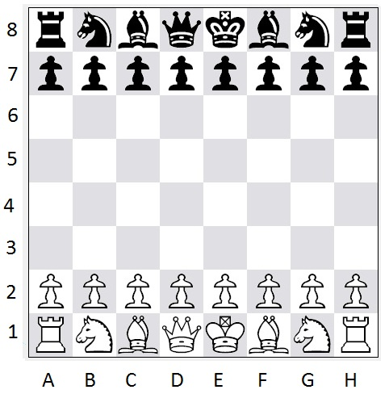

## NOTES

This assignment has 4 programming questions for everyone, and 1 programming question for grad students. 

Your assignment must be submitted by the due date listed at the top of this document, and it must be submitted electronically in .pdf format via Crowdmark. 

This means that your responses for different question parts should begin on separate pages of your .pdf file. Note that your .pdf solution file must have been generated by R Markdown. Additionally:

Organization and comprehensibility is part of a full solution. Consequently, points will be deducted for solutions that are not organized and incomprehensible. Furthermore, if you submit your assignment to Crowdmark, but you do so incorrectly in any way (e.g., you upload your Question 2 solution in the Question 1 box), you will receive a 5% deduction (i.e., 5% of the assignment’s point total will be deducted from your point total).

There are 44 marks for Stat 442 students, and 54 marks for Stat 842 students.

\newpage

This dataset is from an ongoing chess analysis project with Ariel Sheynzon called "Queens and False Hydras". In the dataset each line represents a board position that happened in a game between two highly rated players on Lichess.org.

Each board setup has been evaluated by a chess engine (specialist AI) called Fairy Stockfish, and the evaluation recorded in centipawns of white player advantage. For example, if the board setup was evaluated to be 345, that would mean that the white (first) player currently had a 3.45 pawn advantage.

From each position, a target piece was then removed and the board setup re-evaluated. The difference in the evaluations is the estimated "removal value", or `remove_value` of the piece. For example if a k`N`ight was removed from the `f3` square on the board, the evaluation changes by 536 centipawns, implying that the knight is "worth" 5.36 pawns in that situation.

`loc_removed` is the location of the piece being removed, in algebraic notation. This has been split in the prep code below into `rank_removed` (y) and `file_removed` (x).

`target_piece` indicates which piece was removed (side ignored), among k`N`ight, `B`ishop, `R`ook, or `Q`ueen. 

You have the full dataset in `Chess evals 1 piece removed 2024-12-23.csv`, but you will only need a few of the variables for this assignment.

*Lore note: A false hydra is a Dungeons and Dragons creature that can kill without leaving a trace, similarly, we have removed a piece from the board without leaving a trace, that is, by not moving another piece into it.*


Q0) (0 marks) Run the following code to prepare the data. You may need to `install.packages("stringr")` first. You should get a simple table of six rows, and bimodal histogram.

```{r}
library(stringr)

dat_chess = read.csv("Chess evals 1 piece removed 2024-12-23.csv")
dat_chess = dat_chess[,c("target_piece", "loc_removed", "remove_value")]
dat_chess = subset(dat_chess, !is.na(remove_value))
dat_chess = subset(dat_chess, remove_value < 2000 & remove_value > 0)

dat_chess$remove_value = abs(dat_chess$remove_value)
dat_chess$target_piece = toupper(dat_chess$target_piece)


dat_chess$file_removed = NA

dat_chess$rank_removed = 
  as.numeric(str_sub(dat_chess$loc_removed, 2,2))

for(k in 1:nrow(dat_chess))
{
  dat_chess$file_removed[k] = 
    which(letters == str_sub(dat_chess$loc_removed[k], 1, 1))
}


# take a random sample of 
sample_idx = which(row.names(dat_chess) %in% c(26842, 31374, 19103, 778, 27433, 17317))
dat_chess[sample_idx, ]

hist(dat_chess$remove_value)

```

\newpage

Q1) Grammar of Tables (12 marks) Make a `gt` table of the 20 rows in `dat_chess_q1` in which...

- There is a title that says "Queens and False Hydras"
- There is a subtitle that says "Value of pieces when removed from the chess board"
- The rows are organized from highest to lowest `remove_value`
- The `remove_value` column is background colour coded so that the greatest value is `#8888FF` and the least value is `#22CCFF`.
- The `target_piece` column is colour coded so that each of `R`, `Q`, `N`, and `B` has a distinct background colour, such that the text is readable.
- The font is the Roboto Google Font

Show your code and the resulting table

( You may find this presentation useful: https://themockup.blog/static/slides/intro-tables-urban.html )

```{r}
library(dplyr)
library(gt)

q1_idx = seq(from=1, to=19001, by=1000) #1, 1001, 2001, 3001, ... , 19001
dat_chess_q1 = dat_chess[q1_idx, ]

dat_chess_q1 %>%
    arrange(
    desc(dat_chess_q1$remove_value)
  ) %>%
  gt() %>%
  tab_header(
    title = "Queens and False Hydras",
    subtitle = "Value of pieces when removed from the chess board"
  ) %>%
  data_color(
    columns = vars(remove_value),
    colors = scales::col_numeric(
      palette = c("#22CCFF", "#8888FF"),
      domain = NULL
    )
  ) %>%
  data_color(
    columns = vars(target_piece),
    colors = scales::col_factor(
      palette = c("#FF0000", "#00FF00", "#0000FF", "#FF00FF"),
      domain = c("R", "Q", "N", "B")
    )
  ) %>%
  tab_style(
    style = list(
      cell_text(
        font = "Roboto"
      )
    ),
    locations = cells_body(
    )
  )


```


\newpage


Q2) (12 marks) Ridgeline plot. 

Draw a ridgeline plot using the ` geom_density_ridges()` geometry in the `ggridges` package and `dat_chess` such that...

- Each row has a KDE of the  distribution of `remove_value` for one of the four pieces
- Each row is labelled with the NAME of the piece (not just the single letter code)
- Rows are `reorder`ed such that the group with the highest mean value is placed on the top.
- Each KDE has a different line colour from the `viridis` palette.
- Each KDE uses the same fill gradient from the `viridis` colour scale.
- Clipping is turned off so the top of the KDE doesn't get cut off.
- `theme_ipsum()` is used.
- There is no guide or legend shown.

You may find https://wilkelab.org/ggridges/articles/introduction.html useful, especially for the fill gradient.

```{r}
library(ggplot2)
library(ggridges)
library(viridis)
library(viridisLite)
library(hrbrthemes)

palette = viridis(4)

labels = c("Bishop", "Knight", "Queen", "Rook")

dat_chess_q2 <- dat_chess %>%
  group_by(target_piece)

dat_chess_q2$target_piece = factor(dat_chess$target_piece, levels = c("B", "N", "Q", "R"), labels = labels)

ggplot(dat_chess_q2, aes(x = remove_value, y = reorder(target_piece, remove_value, FUN=mean), fill = target_piece,)) +
  geom_density_ridges(alpha=0.5, aes(color = target_piece), scale = 0.9, size = 1.5, point_shape = NA, point_size = 0) +
  coord_cartesian(clip = "off") +
  scale_fill_viridis_d() +
  labs(x = "Remove value", y = "Target Piece",
       title = "Ridgeline plot of piece removal values") +
  theme_ipsum() +
  theme(legend.position = "none")
```


\newpage


Q3) (12 marks) Facets and KDEs. ( marks)

Draw a ggplot of `dat_chess` using `geom_density()` and `facet_wrap()` such that...

- Each facet has a KDE of the distribution of `remove_value` for one of the four pieces.
- Each KDE has a line width of 3.
- The KDE has a line colour of blue, forestgreen, red, or black for bishop, knight, queen, and rook respectively.
- The KDE has a fill colour matching the line colour, but at 50% opacity.
- The mean removal value of each piece is written in the top right corner (black, bold, any font).
- `theme_ipsum()` is used.
- There is no guide or legend shown.

For finding the mean removal of each piece, something like `by(value, piece, mean)` or a `ddply` summarize may be useful.

```{r}
library(ggplot2)
library(dplyr)
library(hrbrthemes)

# Compute mean values using `by()`, then convert to a data frame
mean_values = as.data.frame(by(dat_chess$remove_value, dat_chess$target_piece, mean))

# Ensure column names are correct
colnames(mean_values) <- c("mean_val")
mean_values$target_piece <- rownames(mean_values)  # Convert rownames to a proper column

# Define colors for each piece
colors = c("blue", "forestgreen", "red", "black")

#create the plot
ggplot(dat_chess, aes(x = remove_value, fill = target_piece, color = target_piece)) +  
  geom_density(alpha = 0.5, size = 3) + 
  facet_wrap(~target_piece) +  
  geom_text(mapping = aes(x = Inf, y = Inf, label = paste("Mean:", round(mean_val, 2))),  
            data = mean_values, hjust = 1, vjust = 1, fontface = "bold", color = "black") +
  theme_ipsum() +  
  theme(legend.position = "none") +  
  scale_color_manual(values = colors) +  
  scale_fill_manual(values = colors)

```


\newpage


Q4) (8 marks) Tile plot. 


Draw a heatmap of the average removal value (value) of `dat_chess_q4` using `geom_tile()` such that...

- The x axis maps to file.
- The y axis maps to rank.
- The fill maps to value.
- The file is labelled with lower case letters a...h.
- The rank is labelled with the numbers 1,2,...,8
- The image `starting_position_algebraic.jpg` (see below) is shown underneath the `geom_tile`.

To add the image, see `geom_image()` in https://www.r-bloggers.com/2024/04/three-ways-to-include-images-in-your-ggplots/ 

```{r}
library(ggimage)
dat_chess_q4 = subset(dat_chess, target_piece == "N")

dat_chess_q4 = ddply(dat_chess_q4, "loc_removed", summarize,
                     file = file_removed[1],
                     rank = rank_removed[1],
                     value = mean(remove_value),
                     count = length(remove_value))

dat_chess_q4$filename = letters[dat_chess_q4$file]

plot <- ggplot(dat_chess_q4, aes(x = file, y = rank, fill = value)) +
  geom_tile() +
  scale_fill_viridis() +
  scale_x_continuous(breaks = 1:8, labels = letters[1:8]) +
  scale_y_continuous(breaks = 1:8) +
  theme_minimal() +
  theme(legend.position = "none",
        axis.title = element_blank(),
        panel.grid = element_blank(),
        panel.background = element_rect(fill = "white"))


ggbackground(plot, "starting-positon-algebraic.jpg") +
  geom_image(aes(image = "starting-positon-algebraic.jpg"), 
             x = 0.6, y = 0.6, 
             xmin = 0, xmax = 10, ymin = 1, ymax = 8) +
  coord_fixed(ratio = 0.7) 

```




\newpage


**(Stat 842 and CM 762 only. Stat 442 students may attempt this question, but it will not be marked)**

Q5) (10 marks) Manim histogram.

Using the defaults in the Jan 31 lab, construct a histogram of all the removal values in Manim using 20 bars.

- Using 20 bars.
- Setting a y-axis tick mark every 500.
- Setting the y-axis from 0 to 5000.
- Setting the background to white.
- Setting a title above the middle of the graph of "Histogram of Piece Values"

Hint 1: In the Jupyter notebook, hold shift and right-click in order to save an image.

Hint 2: In R markdown, you can embed an image with ``


